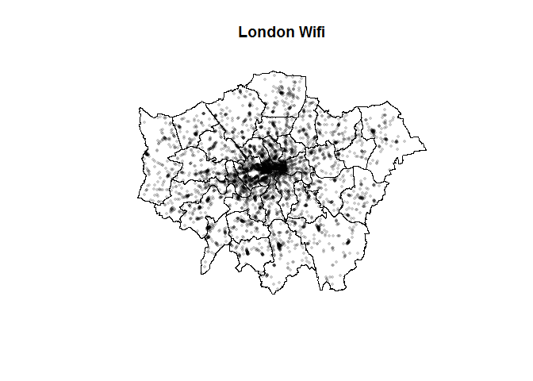
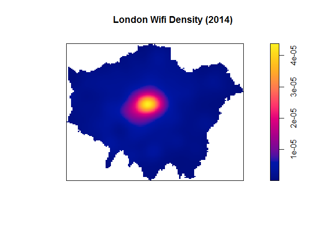

### 1. Data Source and Data Pre-processing

The dataset used in this report is provided by the ESRC Consumer Data Research Centre. The csv files contain information about WiFi networks that are purposely made available to public members from June to July 2014 in London, comprising projection coordinates (easting and northing), geographic coordinates (latitude and longitude), number of public WiFi hotspots in one place and the postcode. Besides, the London boundary shapefile was downloaded from the UK Data Service.

However, the csv files containing London WiFi data are separated by the Local Authority District, so the first thing we need to do is using R to combine them into one single csv file.

``` r
setwd("E:/UCL/GIS/Assessment1/data/London_Wifi")

# Get the files names
fileNames <- list.files(pattern = "*.csv")

# Combile files
readFiles <- lapply(fileNames, function(x) read.csv(x, stringsAsFactors = F, header = T))
fileBind <- do.call(rbind, readFiles)

# Save combined file
setwd("E:/UCL/GIS/Assessment1/data")
write.csv(fileBind, "London_Wifi.csv")

wifi_all <- read.csv("London_Wifi.csv")
head(wifi_all)
```

    ##   X   pcd hotspots easting northing    latitude longitude
    ## 1 1 E16AN        1  533414   181742 -0.07853589  51.51885
    ## 2 2 E17AA        1  533608   181326 -0.07589907  51.51507
    ## 3 3 E17BH        1  533479   181372 -0.07773963  51.51551
    ## 4 4 E17BS        2  533544   181365 -0.07680609  51.51543
    ## 5 5 E17DB        1  533511   181437 -0.07725414  51.51609
    ## 6 6 E17HP        1  533448   181666 -0.07807490  51.51816

### 2. Point Density Map

Point Density Map is a raster map reveals where points are clustered in a given area by calculating the density of point features around each output raster cell. This report introduces two ways to make point density maps, one by the GUI-based software ArcGIS, and one by the opensource code-based software R.

#### 2.1 ArcGIS

-   Load the London boundary shapefile. Check the data source and find it uses British National Grid as the projection coordinate system.
-   Load csv file and use Display XY Data tool to draw points on map (Use projection coordinates as the XY field to fit with London boundary shapefile). Export it to a point shapefile.
-   Load basemap by ArcGIS Online
-   Use Point Density tool to get a raster layer. Remember to choose hotspots as the population field because it denotes population values for each point and set Extent and Mask as the London boundary shapefile in the Environment Settings.
-   In the layer properties of raster layer, change the symbology method into Classified and choose classification method as Natural Breaks (Jenks). This classification method can maximize the differences between classes.


#### 2.2 R

-   Load London Boundary shp

``` r
setwd("D:/Documents/GitHub/GIS/Assessment Part 1")

library(spatstat)
library(sp)
library(rgeos)
library(maptools)
library(GISTools)
library(tmap)
library(tmaptools)

# load Borough data
BoroughMap <- read_shape('LondonBorough/LondonBouroughs.shp',as.sf=FALSE)
BNG = "+init=epsg:27700"
BoroughMapBNG <- spTransform(BoroughMap,BNG)
```

-   Load Wifi Points

``` r
# load wifi data
LondonWifi <- read.csv("London_Wifi.csv", header = T, sep = ",")
coordinates(LondonWifi) <- ~latitude + longitude
proj4string(LondonWifi) = CRS("+init=epsg:4326")
WifiBNG <- spTransform(LondonWifi,BNG)
WifiBNG <- remove.duplicates(WifiBNG)
WifiBNG <- WifiBNG[BoroughMapBNG,]
```

-   now set the window as the borough boundary and create a point pattern (ppp) object.

``` r
window <- as.owin(BoroughMapBNG)
Wifi.ppp <- ppp(x=WifiBNG@coords[,1],y=WifiBNG@coords[,2],window=window)
plot(Wifi.ppp,pch=16,cex=0.5, main="London Wifi")
```



-   produce a KDE (Kernel Density Estimation ) map from a ppp object using the density function.

``` r
plot(density(Wifi.ppp,sigma = 2000,weights=),main = "London Wifi Density (2014)")
```



### 3. compare two maps
