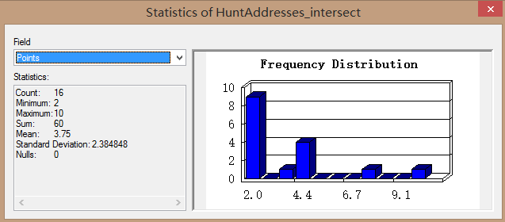

Assessment Part 2
-----------------

Spatial Analysis Methodologies
-----------------------------------------------

word count: 599

### 1. Data Pre-processing

The software used in this report is ArcGIS because the GUI interface is easier to understand, and it provides many useful and powerful tools. Before starting spatial analysis, create a File Geodatabase to store every feature classes we generated later because Geodatabases can overcome some of the limitations of shapefiles. The coordinate system of all the data has changed to British National Grid (BNG). The raw data and data pre-processing processes used in this report are:

- Team7.shp: Last year’s winning group trace. This file only contains geographic coordinate system (GCS_WGS_1984). In order to make spatial analysis later, use Project Tool to project it into BNG. (**Team7_project**)
- LondonStations.kml: Use KML To Layer Tool to convert it into a feature class and use Project Tool to project it into BNG(**LondonStation_project**). 
- huntaddresses.csv: Records treasure hunt locations. Use Display XY Data Tool, choose the BNG as the project coordinate system, and export the map layer (**HuntAddresses_project**)
- London ward boundary with statistical data (**LondonWardsData**).: obtained from ONS Geoportal and The London Datastore. 

### 2.	Challenges

#### 2.1 How far did you travel?

Open the attribute table of Team7_project, add a new filed with Double value type. Right click on this field, choose Calculate Geometry Tool to calculate the vector length. The result shows that we travelled 46603.95m. 

#### 2.2 How many TfL stations did your route pass within 100 metres distance?

Use Buffer Tool to create a 100m buffer around the trace. Then, use Select by Location Tool to select features from LondonStation_project which intersect the buffer. The result shows our trace passed 24 TfL stations within 100 meters distance.

#### 2.3 How many points did you score based on treasure hunt locations they managed to get within 300 metres of? 

Use Buffer Tool to create a 300m buffer around the trace. Then, use Select by Location Tool to select features from HuntAddresses_project which intersect the buffer. Export the selected data as HuntAddresses_intersect. Open the attribute table of HuntAddresses_intersect, right click the Points filed and choose statistics. The result shows that the sum of points we score is 60.

#### 2.4 Which Wards did you pass through that had the (a) lowest and (b) the highest rates of Male Life Expectancy?

Use Select by Location Tool to select features from LondonWardsData which intersect the trace. Export the result as LondonWardsData_intersect. Then, Open the attribute table of LondonWardsData_intersect, double click the Male_lifeExpec_2009_13 field to make the value ordered and find that Weavers has the lowest Male Life Expectancy (75.06) while City of London has the highest (84.31)

#### 2.5 Taking the average of all Wards that you passed through, what was the average life expectancy at birth for babies born in those wards along the whole route? This can be both Male and Female life expectancies.

Right click the Male_lifeExpec_2009_13 and Female_lifeExpec_2009_13 fields and choose statistic. The result shows that the average life expectancy for male and female is 78.77 and 84.04.

#### 2.6 Are there any spatial patterns for CASA Treasure Hunt locations or are they randomly distributed?

The distribution of the points is shown below. 

The principle of nearest neighbour analysis is to calculate the mean distance between points and compare it with the distance under complete Spatial Randomness. Use Average Nearest Neighbour Tool to do the analysis and choose the distand method as Euclidean. The report shows that the ratio is 1.04 and the z-score is 0.59 (-1.96<z<1.96), which means the patterns does not appear to be significantly different than random.   

