Assessment Part 3
-----------------

Creating a Housing Rental Cost-Effective Index for Subway Stations
-----------------------------------------------

word count: 1670

### 1. Introduction

Many researches have proved that the construction of subway can influence house price. Bajic (1983) studied the Spadina subway in Toronto and found that lowering the cost of travel by subway construction can led to an increase in the house price nearby. Celik and Yankaya (2006) studied the house prices of 360 houses around the Izmir subway from December 2003 to March 2004 and found that the subway had a significant positive impact on the price of nearby houses. Because of the fast and convenient of subway, the houses near the subway stations are considered good catches in the real estate market. However, when considering renting a house near subway stations, price is not the only thing that need to be considered. What people really searching for are the houses have high cost-effective. They will ask a question like: which subway stations have less housing rental price nearby and more numbers of companies/hospitals/schools quickly accessible along subway lines? 

This paper proposes a concept of half-hour commute coverage per subway station, defined as the area with 15-minute subway and 15-minute walk. We assume that the average speed of subway and human walking is 80km/h and 4km/h, which means that the half-hour commute coverage is equal to 20km subway and 1km walk. In this case, We use house price and number of companies as the variables that influence people's desicen. So, the vague question asked above can be transfered into a more specific question: **Which subway stations have less housing rental price (RP) within 1km walk and more numbers of companies (NOC) in their half-hour commute coverage?**

This paper develops two ArcGIS tools to answer this question. The first one aims at finding the routes within 20km distance of each station using network analysis, and the second one outputs NOC/RP as the housing rental cost-effective index (HRCEI) of each subway station. To illustrate it more specifically, we use Nanjing and its financial related company as an example.

### 2. Data Preperation

- Housing Rental Price: The names and average housing rental prices of all communities in Nanjing are crawled from Lianjia website, one of the most popular second-hand housing trading platforms in China ( https://nj.lianjia.com/xiaoqu/ ). Then, use the Geocoding function and API of Baidu Map to get the latitude and longitude of communities based on their names. The information is stored as csv files. Load the csv file into ArcGIS and transfer them into point shapefiles. 
- Financial Companies Information: The names of financial related companies are crawled from Job5156.com (http://www.job5156.com/qiye/nanjing-8/pn3/), which is a job hunting website in China. Then, use the Geocoding function and API of Baidu Map to get the latitude and longitude of companies based on their names. The information is stored as csv files. Load the csv file into ArcGIS and transfer them into point shapefiles.
- Nanjing Boundary shapefile: downloaded from OSM Boundaries Map.( https://wambachers-osm.website/boundaries/ )
- Subways shapefile: downloaded from BBBike ( https://extract.bbbike.org/ ). Make sure all the line segments are disconnected at each subway stations. In the geodatabase, create a new feature dataset with subway line shapefile we edited and then create a new network dataset for further network analysis.
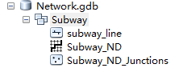
- All the files above are transferred to WGS 1984 Geographic Coordinate System and WGS_1984_UTM_Zone_50N Project Coordinate System.

### 3. Analysis Process
#### 3.1 Network Analysis Tool

This tool aims at finding the routes and stations within 20km distance of each station using network analysis. This task can be transfered to a "Finding closet facility" problem. For the subway line network dataset, use Make Closet Facility Layer Tool to open a closet facility analysis layer. Choose the impedance attribute as length, set the default cutoff value as 20,000 and the facilities to find as 131 (The maximum number of stations). Load stations shapefile as both Facilities and Incidents, and then use Solve Tool to find the routes and stations within 20km distance of each station along subway line.

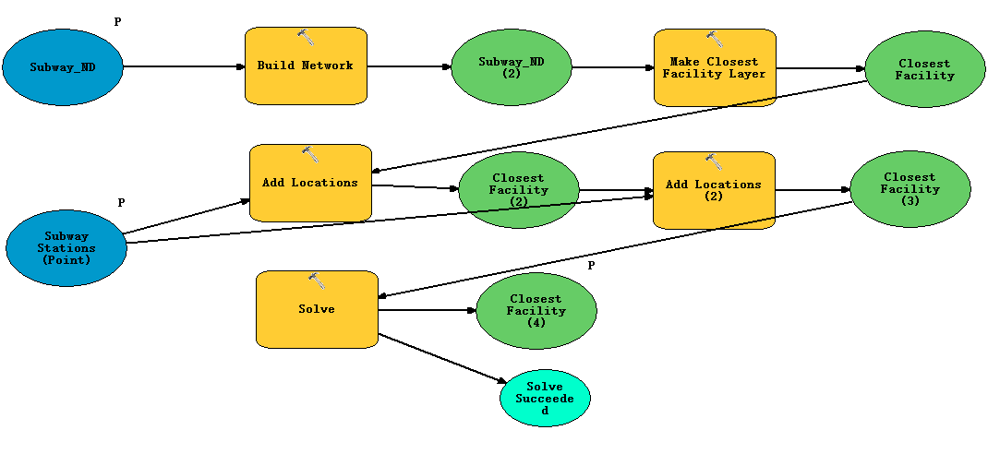

Set the subway line network dataset and subway station point shapefile as model parameter. Right click on the closest facility layer in model, choose Add to Display to display this layer after running this tool. The interface of this tool is shown below:

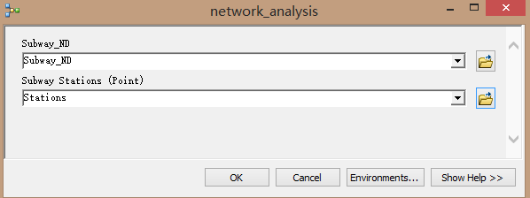

#### 3.2 HRCEI Tool

The aim of HRCEI Tool is to input station point shapefile, house price point shapefile, company location point shapefile and routes obtained from Network Analysis Tool to calculate the Housing Rental Cost-Effective Index (HRCEI) of each subway station. The analysis process is as followed: 

##### 3.2.1 Calculate the average housing rental price per subway station. (RP)

Use Buffer Tool to create a 1km buffer of each station and use Spatial Join Tool to join the house price into buffer, choose the merge rule as “mean” and calculate the average housing rental price per subway station buffer. Then, use Join Field Tool to transfer the price per buffer into price per station. The process and result are shown below.

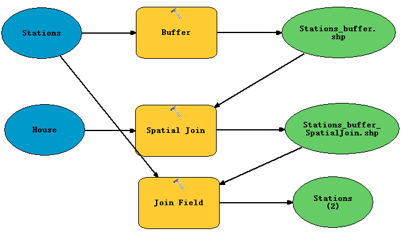

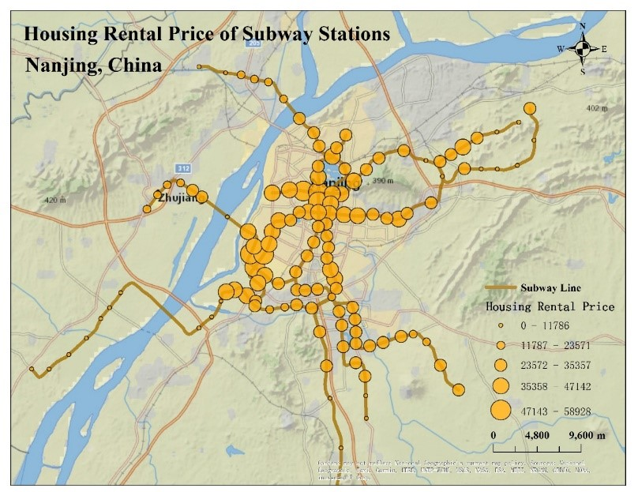

##### 3.2.2 Create half-hour commute coverage per subway station.

The half-hour commute coverage per subway station is defined as 20km subway and 1km walk. The attribute of the routes we obtained from Network Analysis Tool is shown below. The routes have covered from the nearest stations to the farthest stations, which means there exist repetitive path. So, we use Dissolve Tool to combine the lines with same Incident ID. 

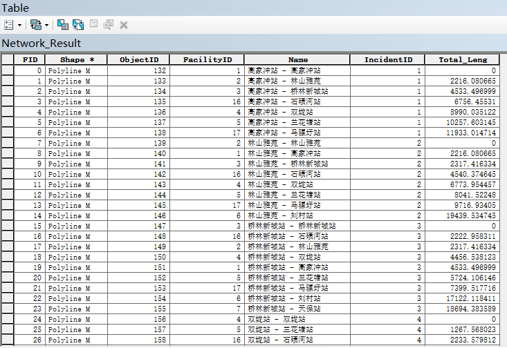

Then, create a 1km buffer of the lines we obtained above and use the 1km buffer of subway stations to clip it because we can only get off the subway at the stations. For example, the half-hour commute coverage of JiuLongHu station is shown below. 

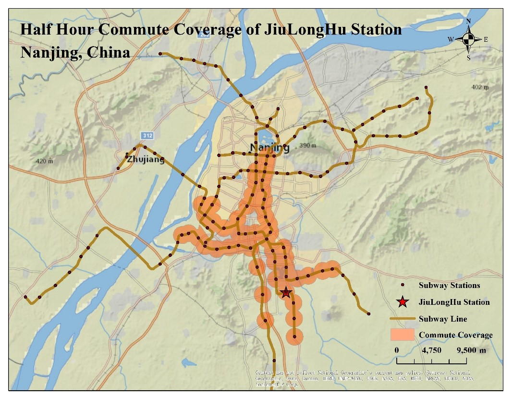

##### 3.2.3 Calculate the number of companies in half-hour commute coverage per station. (NOC)

Use Spatial Join Tool to join the spatial attribute of company shapefile into half-hour commute coverage shapefile and choose the merge rule as “count” to calculate the number of companies in half-hour commute coverage per station. Then, use Join Field Tool to join the result into station shapefile.

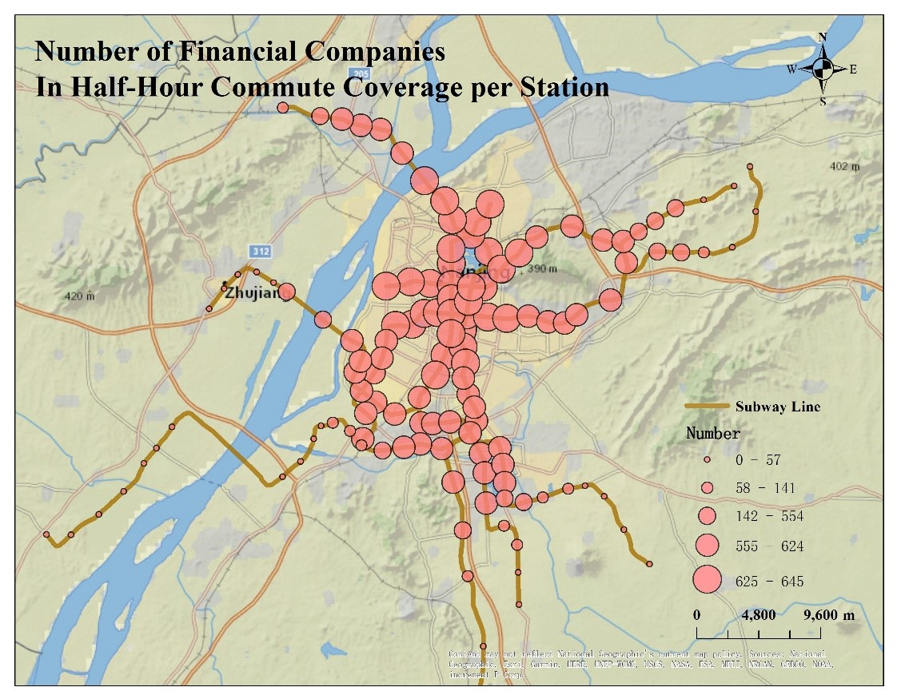

##### 3.2.4 Use RP and NOC to calculate the housing rental cost-effective index (HRCEI)

The attributes of the result are shown below, including station’s name, the average housing rental price (RP) within 1km distance per station and the numbers of financial related companies (NOC) in the half-hour commute coverage per station. In this paper, we use NOC/RP as the housing rental cost-effective index (HRCEI) of each subway station, and when the average rental price is zero, the HRCEI is zero too. Add a new field named “HRCEI” in the attribute table and use python in Filed Calculator to calculate it.

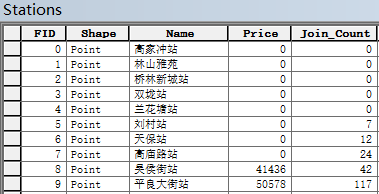

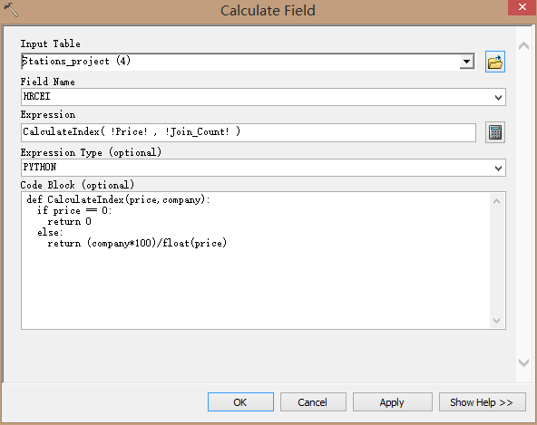

However, it would be more easily to compare if the indexes are all between zero and one. So, we then divide all the indexes by the maximum value to get a standardize index. 

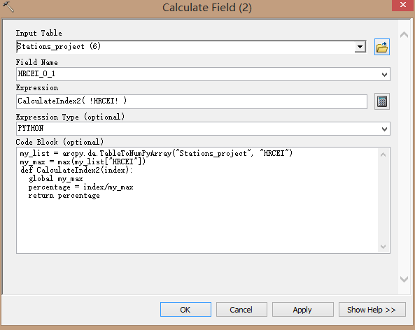

##### 3.2.5 Set Model Parameter

Set subway station point shapefile, house price point shapefile, company location point shapefile and Routes result from Closest Facility Layer as the model parameter, the interface of the ArcGIS Tool is shown below. The analysis result is stored in station point shapefile. 

### 4. Result

Load China Executive Map (Web Mercator) from ArcGIS online as the basemap. In the symbology part of Layer Properties, choose graduated symbols to display HRCEI value. The thematic map is shown below. From this map, we can infer that for financial related workers, the houses near the northern and southern subway stations have higher cost performance while the houses near the stations in central city have much less cost performance. This index can provide a scientific basis for people to choose a housing rental location.

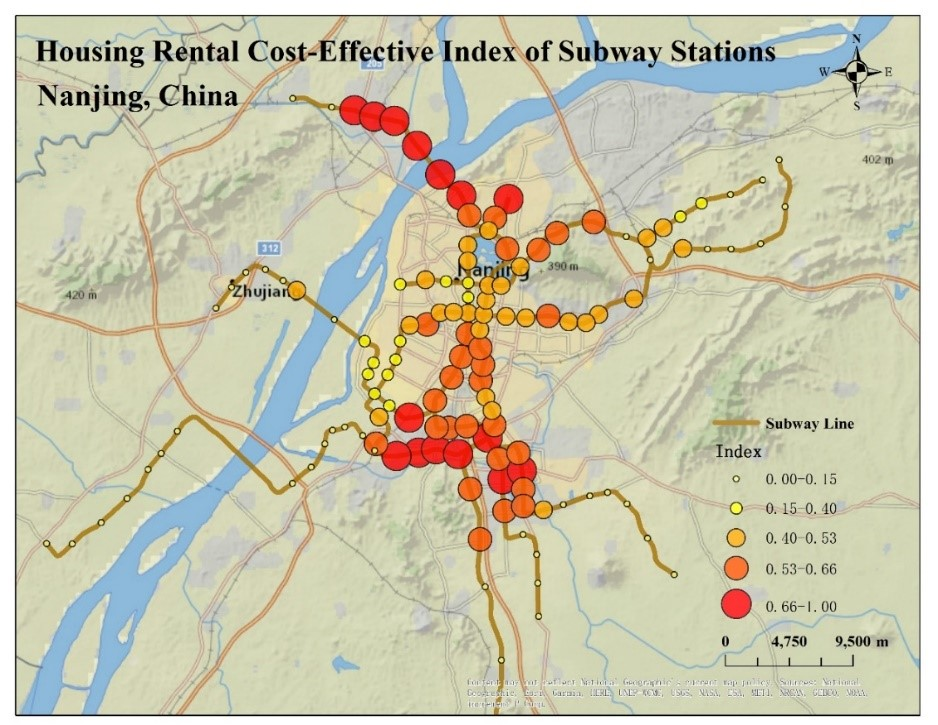

### 5. Strengths and Limitations

This paper has developed two ArcGIS Tools to answer a very practical question proposed in our daily life. The housing rental cost-effective index can provide a scientific basis for people to make a decision. Instead of a simple buffer around subway lines, we use the half-hour commute coverage of each subway station, which is more consistent with our daily life. The companies can be replaced by hospitals, schools, entertainment venues or anything you interested, and the principle is as the same. Using only house price and number of companies as variables may have limitations to define the housing rental cost-effective index, but it still can help certain people to make decisions. To make the index more meaningful, we can add more varianbles in the analysis and build a more complicated model. 

The locations of houses and companies are obtained by the geocoding function of Baidu Map based on their name. So, there may exist uncertainty errors with their names accuracy. For example, some of the names cannot be found in Baidu Map or the searched address are inconsistent with their names. This problem can largely influence our final decision and is hard to detect and revise. Therefore, the ArcGIS Tools developed in this paper may need more accuracy data as the input data to get a more reliable result. Also, because the network dataset cannot be created by model builder, users need to generate the network dataset by themselves and use it as the input data. Besides, because the result of the network analysis is a layer in model builder and the route line cannot be directly used in the same model building environment, the two tools cannot be combined as one, which is quite an annoying thing. Furthermore, it would be better if the tools can add more parameters like buffer distance and default cutoff value of network analysis to make them suitable for other situations. 

### Reference

BAJIC V. The effects of a new subway line on housing prices in metropolitan Toronto [J]. Urban Studies, 1983, 20: 147-158.

CELIK H M, YANKAYA U. The impact of rail transit investment on the residential property values in developing countries: the case of Izmir subway, Turkey [J]. Property Management，2006，24: 369-382.
